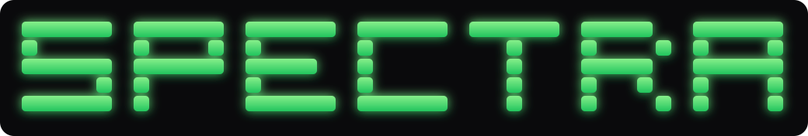

<div align="center">

<p align="center">
  
</p>

<h3><code>vision-assisted terminal research</code></h3>

[]()
[]()
[]()
[]()
[]()

*Point it at a page. It looks, it thinks, it writes the research notes.*

</div>

---

<br>

## ✦ What is this

**SPECTRA** is a terminal-native research instrument. Give it a URL and a question:

1. It **sees** — headless Chromium renders the page at a fixed 1280×800 desktop viewport and captures a full-quality PNG in memory.
2. It **thinks** — the screenshot goes to a *local* vision-language model (MiniCPM-V 4.6 via Ollama). Nothing leaves your machine.
3. It **writes** — a structured synthesis with summary, key findings, entities, extraction points and open questions, exportable as **Markdown** or a **styled PDF** (with the screenshot embedded and a references section).

No cloud. No API keys. No telemetry. Your research stays on your hardware.

<br>

## ✦ Pipeline

```
┌─────────────────────────────────────────────┐
│           ▸ SPECTRA RESEARCH RUN            │
└──────────────────────┬──────────────────────┘
                       ▼
┌─────────────────────────────────────────────┐
│ 1 ▸ CAPTURE                        chromedp │
│     headless render · 1280×800 PNG          │
│     fully in-memory                         │
└──────────────────────┬──────────────────────┘
                       ▼
┌─────────────────────────────────────────────┐
│ 2 ▸ INFER                       Ollama REST │
│     POST /api/generate                      │
│     minicpm-v4.6 · 127.0.0.1:11434          │
└──────────────────────┬──────────────────────┘
                       ▼
┌─────────────────────────────────────────────┐
│ 3 ▸ SYNTHESIZE                     goldmark │
│     structured GFM notes                    │
│     <think> stripped · clean markdown       │
└──────────────────────┬──────────────────────┘
                       ▼
┌─────────────────────────────────────────────┐
│ 4 ▸ EXPORT                                  │
│     [m] spectra_host.md · metadata header   │
│     [p] spectra_host.pdf · screenshot+refs  │
└─────────────────────────────────────────────┘
```

<br>

## ✦ Views — the four-state TUI

| | |
|---|---|
| **INPUT FORM** | Centered layout, block-ASCII wordmark in terracotta, live Ollama status pill, rounded 64-col input card |
| **EXECUTION** | Three animated stages — `[1/3] capture ▸ [2/3] inference ▸ [3/3] synthesis` — with live spinners |
| **RESULTS** | Scrollable viewport of the synthesized markdown with metadata line |
| **EXPORT** | Quick-keys: `m` markdown · `p` pdf · `r` new run · `q` quit |

```
                         ● OLLAMA: READY
╭────────────────────────────────────────────────────────────────╮
│  TARGET URL                                                    │
│  > https://news.ycombinator.com/item?id=41234567               │
│                                                                │
│  RESEARCH OBJECTIVE / QUERY                                    │
│  > Extract the top technical claims and who made them          │
╰────────────────────────────────────────────────────────────────╯
 [tab] switch field   [enter] begin research run   [ctrl+c] quit
```

<br>

## ✦ Install

### Windows

```bat
git clone <your-repo> spectra && cd spectra
go build -trimpath -ldflags="-s -w" -o spectra.exe .
install.bat
```

`install.bat` copies the binary to `%LOCALAPPDATA%\Programs\spectra` and adds it to your user `PATH` — open a **new terminal** afterwards and it's global:

```bat
spectra
```

### Linux / macOS

```bash
git clone <your-repo> spectra && cd spectra
go build -trimpath -ldflags="-s -w" -o spectra .
./install.sh          # → ~/.local/bin (checks PATH)
```

<br>

## ✦ Prerequisites

| Need | Why | Get it |
|---|---|---|
| **Go 1.24+** | build only | [go.dev/dl](https://go.dev/dl/) |
| **Chromium-family browser** | Chrome, Edge, or Chromium — auto-detected, Edge is a full fallback | any |
| **Ollama** | local inference daemon | [ollama.com](https://ollama.com) |
| **Vision model** | the eyes of the operation | `ollama pull minicpm-v4.6:latest` |

### Pre-flight check

```bash
spectra --check
```

```
[1/3] Browser detection...
      OK: C:\Program Files\Microsoft\Edge\Application\msedge.exe
[2/3] Ollama daemon...
      OK: http://127.0.0.1:11434
[3/3] Vision model (minicpm-v4.6:latest)...
      OK

All systems nominal. Launch `spectra` for the TUI.
```

<br>

## ✦ Usage

```bash
spectra                          # interactive TUI
spectra --check                  # 3-point diagnosis, no TUI
spectra --smoke example.com      # headless one-shot → ./exports/ + stdout report
```

**Everyday flow:** type URL → `tab` → type research query → `enter` → wait for the three stages → read/scroll → `e` → `m` and/or `p` → `r` for the next run, `q` to leave.

| Key | Context | Action |
|:---:|---|---|
| `tab` / `shift+tab` | form | switch field |
| `enter` | form | begin research run |
| `↑ ↓ pgup pgdn` | results | scroll |
| `e` | results | open export dialog |
| `m` | export | save Markdown |
| `p` | export | compile PDF |
| `r` | export | new research run |
| `esc` | results/export | go back |
| `q` / `ctrl+c` | anywhere | quit |

**Pasting URLs:** go ahead — paste straight from the browser bar. SPECTRA normalizes everything: surrounding quotes/brackets, stray whitespace and zero-width characters, trailing punctuation, `#fragments`, and common tracking params (`utm_*`, `fbclid`, `gclid`, …) are stripped; `https://` is added if missing; the URL is validated before Chrome ever launches.

Exports land in `./exports/` (relative to wherever you launched):

```
exports/spectra_example.com_2026-09-14_21-05-33.md
exports/spectra_example.com_2026-09-14_21-05-33.pdf
```

<br>

## ✦ Configuration

| Variable | Default | Purpose |
|---|---|---|
| `OLLAMA_HOST` | `http://127.0.0.1:11434` | Ollama endpoint |
| `OLLAMA_MODEL` | `minicpm-v4.6:latest` | any local vision model tag |
| `CHROME_PATH` | *(auto-detect)* | explicit browser executable |

<br>

## ✦ Troubleshooting

| Symptom | Fix |
|---|---|
| `● OLLAMA: OFFLINE` | start the daemon: `ollama serve` (or launch the Ollama app — it lives in the system tray) |
| `● OLLAMA: MODEL MISSING` | `ollama pull minicpm-v4.6:latest` |
| `no Chrome/Edge/Chromium found` | install one, or `setx CHROME_PATH "C:\path\to\browser.exe"` |
| run feels slow | vision inference is GPU-bound; 30s–3min per page is normal on CPU |
| pasted URL rejected | it's validated *after* normalization — the error names the exact problem |

<br>

## ✦ Project layout

```
main.go       entry · preflight · --check / --smoke harness
tui.go        Bubble Tea state machine — Model / Update / commands
ui.go         view layer — every view centered via lipgloss.Place
styles.go     design tokens · segmented-block ASCII banner · all styles
url.go        pasted-URL hygiene — normalize · validate · tracking-strip
scraper.go    chromedp capture — 1280×800 · browser auto-detection
ollama.go     Ollama REST client — ping · model check · vision generate
export.go     markdown writer · styled PDF compiler (fpdf + goldmark AST)
ui_test.go    banner geometry · centering regression tests
url_test.go   URL normalization regression tests
docs/         banner.svg — README wordmark (same 5×5 font, green glow)
```

<br>

## ✦ Design notes

- **Palette** — matte dark base `#0a0a0c` · terracotta `#D97757` · ember `#E06C54` · electric cyan `#7aa2f7` · lavender `#bb9af7` · zinc `#3b4261` · mint `#73daca`
- The wordmark is generated from a 5×5 segmented block font at compile time, so every row is provably equal width (guarded by a unit test)
- The README banner is a glowing-green SVG render of that same font (`docs/banner.svg`) — GitHub strips color and centering from code blocks, so the wordmark ships as an image; the terminal TUI renders the real ASCII in terracotta
- The whole UI block is centered with `lipgloss.Place` on both axes — resize the terminal and it re-centers
- The banner is testable geometry, not hand-drawn art: `go test` fails if the rows ever go ragged

<br>

## ✦ Privacy

SPECTRA phones nobody. The screenshot goes from Chrome to Ollama on `127.0.0.1` and back to your disk. The only network egress is Chrome fetching the page you asked it to fetch.

---

<div align="center">

<sub>built with <a href="https://github.com/charmbracelet/bubbletea">bubbletea</a> · <a href="https://github.com/charmbracelet/lipgloss">lipgloss</a> · <a href="https://github.com/chromedp/chromedp">chromedp</a> · <a href="https://ollama.com">ollama</a> — runs where you run</sub>

</div>
